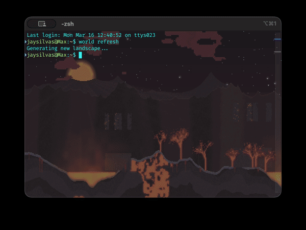

# terminal-worlds

Procedural pixel-art landscapes as iTerm2 terminal backgrounds.



Each new terminal session gets a unique generated image — a different biome, sky, terrain, structures, and lighting — applied automatically via the iTerm2 AppleScript API.

> **Prototype status.** Works end-to-end on macOS/iTerm2. Paths in `update_bg.zsh` and `world.zsh` are currently hardcoded to the dev directory. There is also an experimental Ghostty animated shader background included (`world_shader.glsl`).

---

## Ghostty Animated Background Shader

If you are using the Ghostty terminal emulator, you can use the included GLSL shader for an animated, pixel-art procedural background featuring a day/night cycle, drifting clouds, and wind.

Add the following to your Ghostty config file (on macOS, this is often `~/Library/Application Support/com.mitchellh.ghostty/config` or `config.ghostty`):

```ini
custom-shader = /Users/jaysilvas/dev/terminal-worlds/world_shader.glsl
```

---

## Install

```zsh
zsh install.zsh
```

Then add to `~/.zshrc`:

```zsh
source ~/.terminal-worlds/world.zsh
```

Restart or `source ~/.zshrc`. The pool will warm on first session.

**Requirements:** iTerm2, `uv`, Python 3.13+, Pillow (managed via `uv`).

**Recommended:** Go into Settings/Profile/Window/ and change background image scaling to "Scale to Fit".

---

## Usage

```zsh
world              # Swap to next cached background (runs automatically on new session)
world refresh      # Same as above
world biome <name> # Generate and apply a specific biome
world help         # Show commands
```

**Biomes:** `forest`, `desert`, `corruption`, `volcanic`

---

## Development & Architecture

This repository is optimized for AI agent context. The code is the source of truth rather than a harness of redundant documentation.

For a high-level overview of the implementation, components, and current prototype state, see [ARCHITECTURE.md](ARCHITECTURE.md). For all implementation details, please read the code directly.
